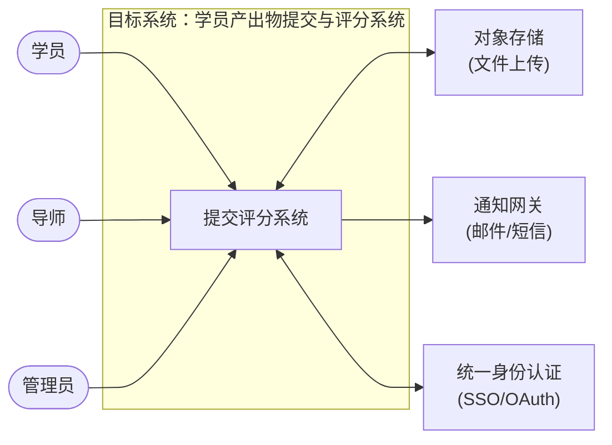
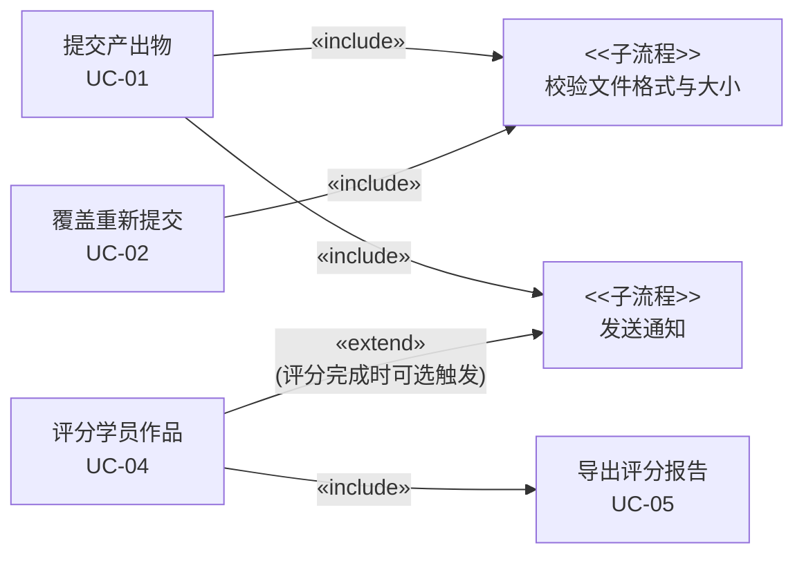

# 27 · 需求分析作业

> **一句话需求**："做一个 Workshop 学员产出物提交与导师评分系统。"

---

## 一、三层需求拆解

### 1.1 业务需求

**背景**：每期 Workshop 结束后，学员需向导师提交阶段性产出物（设计文档、代码、演示稿等），导师逐一打分并给出书面反馈。目前流程依赖邮件收发 + 电子表格汇总，每期平均消耗导师 **8 人时** 做整理，学员收到反馈平均等待 **3 个工作日**，且历史记录无法检索。

**业务目标**：

| 指标 | 当前值 | 目标值（上线第一期起） |
| --- | --- | --- |
| 导师整理提交物的人时消耗 | 8 人时/期 | ≤ 2 人时/期 |
| 学员收到评分反馈的等待时长 | 3 个工作日 | ≤ 1 个工作日 |
| 提交记录可检索覆盖率 | 0% | 100%（所有历史提交可按姓名/期次搜索） |

---

### 1.2 用户需求

**学员**：能在截止时间前通过系统上传产出物（文件或链接），提交后可随时查看自己的评分和导师书面反馈，在截止时间前可覆盖重新提交。

**导师**：能查看当期所有学员的提交列表，对每份产出物打分（0–100 分）并填写文字反馈，完成评分后可一键导出当期评分报告（CSV/Excel）。

**管理员（Workshop 组织者）**：能创建每期 Workshop 活动（设置名称、作业说明、截止时间），能管理学员和导师名单，能查看整体完成进度大盘。

---

## 二、上下文图

> **可从图中读出**：3 类用户角色 + 3 个外部系统依赖——对象存储（大文件上传下载）、通知网关（截止提醒 / 评分完成通知）、统一认证（避免重复登录体系）。这意味着至少 **6 条外部接口**需在 SRS 中明确定义。

---

## 三、候选用例列表（共 8 个）

| 编号 | 用例名称 | 主参与者 | 粒度说明 |
| --- | --- | --- | --- |
| UC-01 | **提交产出物** | 学员 | 核心主流程，粒度合理：有明确前/后置条件和成功标准 |
| UC-02 | **覆盖重新提交** | 学员 | 截止前的修改场景，与 UC-01 独立成用例（触发条件不同） |
| UC-03 | **查看评分结果** | 学员 | 学员的独立子目标：拿到反馈 |
| UC-04 | **评分学员作品** | 导师 | 最核心评分路径，有价值结果清晰 |
| UC-05 | **导出评分报告** | 导师 / 管理员 | 独立的数据导出子目标，不依附于 UC-04 |
| UC-06 | **查看提交进度大盘** | 管理员 | 监控视角，与评分行为分离 |
| UC-07 | **创建 Workshop 活动** | 管理员 | 系统配置前置动作，是 UC-01 的「环境准备」 |
| UC-08 | **管理学员与导师名单** | 管理员 | 独立用户维护子目标（增/删/导入） |

> **粒度自检**：以上每个用例均能写出前置条件 / 后置条件 / 基本事件流，没有过细（如"校验文件格式"不独立成用例）。

---

## 四、核心用例完整描述：UC-01 提交产出物

| 字段 | 内容 |
| --- | --- |
| **编号** | UC-01 |
| **名称** | 提交产出物 |
| **简述** | 学员在截止时间前，通过系统上传本次 Workshop 的产出物（支持文件上传 ≤ 50 MB 或填写外部链接）并附上说明文字，提交后系统通知导师。同一学员在同一活动内首次提交走此用例；截止前修改走 UC-02。主要参与者：学员。 |
| **前置条件** | ① 当前 Workshop 活动处于「进行中」状态且未超过截止时间；② 学员已通过身份认证并已被加入该期活动名单；③ 学员在本期尚未提交过（首次提交） |
| **后置条件** | **成功**：系统创建一条提交记录，状态 = `submitted`，记录提交时间；通知网关向关联导师发送"新提交待评分"通知。**失败**：系统状态不变，无记录写入 |
| **基本事件流** | 1. 学员打开本期 Workshop 详情页 2. 系统展示作业说明和截止时间 3. 学员选择「上传文件」或「填写链接」，填写产出物说明（≤ 500 字） 4. 系统校验文件大小 ≤ 50 MB、格式在白名单内（或链接格式合法） 5. 系统将文件上传至对象存储，返回可访问 URL 6. 系统创建提交记录（student_id, activity_id, url, description, submitted_at），状态置为 `submitted` 7. 系统通过通知网关发送「新提交待评分」邮件至该活动关联导师 8. 系统展示「提交成功」确认页，含提交时间与导师联系人 |
| **异常事件流** | **4a 文件超出 50 MB**：4a1 系统提示"文件过大，请压缩后重试或改用链接方式"，阻止上传 **4b 文件格式不在白名单**：4b1 系统提示支持的格式列表，阻止上传 **5a 对象存储上传失败**：5a1 系统提示"网络异常，请稍后重试"，回滚，不写数据库记录 **7a 邮件通知发送失败**：7a1 仅记录告警日志，**不影响主流程**，提交记录正常入库 **并发重复提交**：系统通过数据库唯一约束（student_id + activity_id）防止并发写入，后一次请求返回"已提交" |

---

## 五、量化非功能需求（≥ 3 条）

> 格式：**描述 / 理由 / 验收标准**

### NFR-01 · 性能——提交接口响应时间

| | 内容 |
| --- | --- |
| **描述** | 学员提交产出物的接口（文件上传完成后保存记录）必须快速响应 |
| **理由** | 截止日前 1 小时往往出现提交高峰（约 80% 学员集中提交），慢响应导致学员反复重试，可能造成重复提交 |
| **验收标准** | 压测场景（100 并发 × 1 分钟）下，P95 响应时间 ≤ 500 ms，P99 ≤ 1 s，错误率 < 0.1%；文件上传进度条实时更新，每 2 s 回报一次进度 |

### NFR-02 · 可用性——活动截止窗口内系统稳定性

| | 内容 |
| --- | --- |
| **描述** | 每期 Workshop 活动存在固定提交截止时间，窗口期内系统须保持高可用 |
| **理由** | 超过截止时间后无法补交，系统故障直接导致学员无法提交，影响评分结果公平性 |
| **验收标准** | 每期活动截止前 48 h 至截止后 1 h 的窗口内，系统可用性 ≥ 99.9%（约 < 2.9 分钟停机）；单次故障 RTO ≤ 10 min；关键依赖（对象存储、通知网关）均有降级策略（通知失败不阻断提交） |

### NFR-03 · 安全性——产出物访问控制与隐私保护

| | 内容 |
| --- | --- |
| **描述** | 学员的提交文件和导师反馈内容属于内部评价数据，不可被未授权人员访问 |
| **理由** | 产出物可能包含学员个人信息和原创作品；导师反馈属于内部评价，泄露可能影响公正性 |
| **验收标准** | ① 产出物文件通过签名 URL 下载（有效期 ≤ 15 min），直接猜测 URL 无法访问；② 仅本人（学员）、本期导师、管理员三类角色可读取；③ 所有查看/下载操作写审计日志（谁/什么时间/访问了哪条记录），日志保留 ≥ 90 天；④ 通过 OWASP Top 10 扫描，无高危漏洞 |

### NFR-04 · 易用性——学员首次完成提交的路径效率（附加）

| | 内容 |
| --- | --- |
| **描述** | 学员首次使用系统完成产出物提交的操作路径需足够简洁 |
| **理由** | Workshop 学员技术背景差异大，复杂交互会导致截止前大量咨询 / 报错 |
| **验收标准** | 用户测试场景下，无使用经验的学员从登录到完成提交全流程 ≤ 3 分钟；页面操作步骤 ≤ 5 步；上传失败时错误提示明确指向解决方案（不出现技术堆栈错误信息） |

---

## 附：用例关系说明（include / extend）

> - `校验文件格式与大小` 被 UC-01 和 UC-02 **必然调用** → `«include»`  
> - `发送通知` 在 UC-04 中是**条件触发**（导师可能关闭通知）→ `«extend»`  
> - `导出评分报告` 是 UC-04 完成后的**必然后续子目标** → `«include»`（也可独立进入，视实现拆分）
