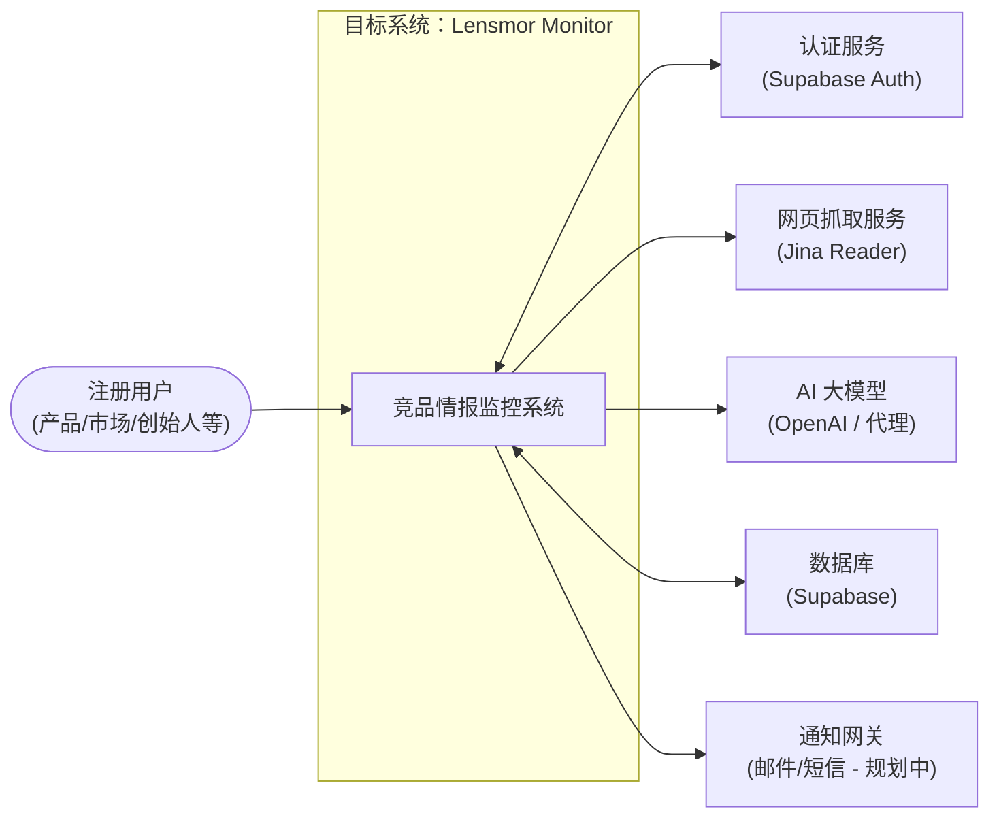
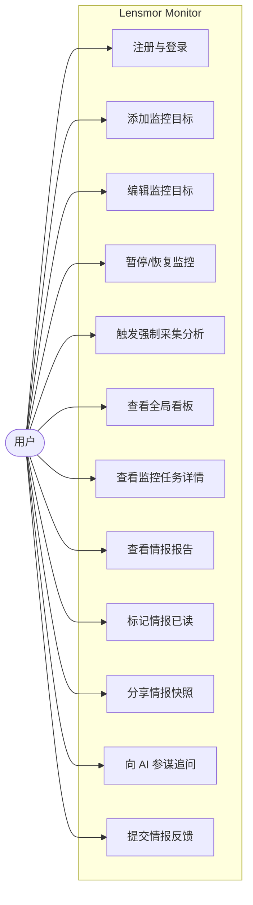
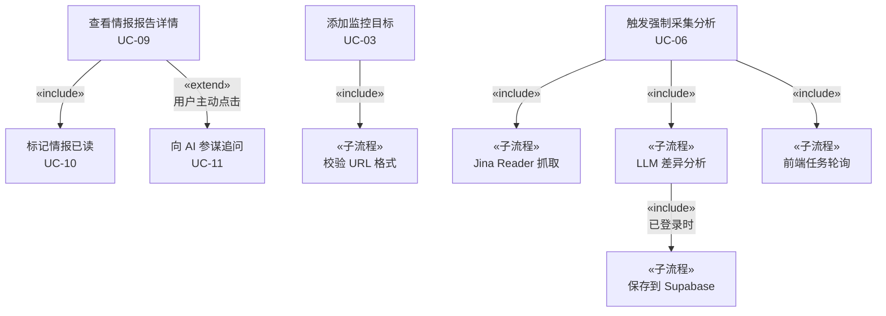

# Lensmor Monitor · 用例文档

> **系统**：竞品情报自动化监控平台  
> **版本**：基于原始需求文档 + 当前代码实现整理  
> **整理方法**：按「§ 3 用例标准」——动宾名称 + 6 字段描述

---

## 一、上下文图

---

## 二、用例图

---

## 三、候选用例列表

| 编号 | 用例名称 | 主参与者 | 优先级 | 说明 |
| --- | --- | --- | --- | --- |
| UC-01 | 注册账号 | 访客 | P0 | 邮箱+密码注册，入口唯一 |
| UC-02 | 登录系统 | 访客 | P0 | 认证后进入监控看板 |
| UC-03 | 添加监控目标 | 用户 | P0 | 输入 URL，创建 monitor_target 记录 |
| UC-04 | 编辑监控目标 | 用户 | P1 | 修改采集频率（每天/每周/手动） |
| UC-05 | 暂停/恢复监控 | 用户 | P1 | 切换 target 状态 active ↔ paused |
| UC-06 | 触发强制采集分析 | 用户 | P0 | 手动触发即时抓取+AI分析，异步任务 |
| UC-07 | 查看全局看板 | 用户 | P1 | 总监控数/未读数/活跃数概览 |
| UC-08 | 查看监控任务时间轴 | 用户 | P0 | 展示该目标的历史情报记录 |
| UC-09 | 查看情报报告详情 | 用户 | P0 | 展开单条报告，查看差异/建议/公司基本面 |
| UC-10 | 标记情报已读 | 用户 | P1 | 展开即自动标记，同步更新未读角标 |
| UC-11 | 分享情报快照 | 用户 | P2 | 生成公开链接，无需登录可查看 |
| UC-12 | 向 AI 参谋追问 | 用户 | P1 | 基于当前情报上下文，流式对话 |
| UC-13 | 提交情报反馈 | 用户 | P2 | 有用/有误/不重要，改进 AI 质量 |

---

## 四、核心用例完整描述（6 字段）

---

### UC-03 · 添加监控目标

| 字段 | 内容 |
| --- | --- |
| **编号** | UC-03 |
| **名称** | 添加监控目标 |
| **简述** | 已登录用户在系统中添加一个待监控的竞品 URL，系统自动提取域名作为任务名称，创建 monitor_target 记录并设置默认采集频率为「每天一次」。主要参与者：用户。 |
| **前置条件** | 用户已通过身份认证（session 有效）；待添加的 URL 格式合法 |
| **基本事件流** | 1. 用户点击「新建监控」按钮，弹出模态框 2. 系统展示 URL 输入框与说明文案 3. 用户输入目标 URL（如 `https://competitor.com`） 4. 系统校验 URL 格式合法性 5. 系统向 `/api/targets` POST 请求，服务端提取 hostname 作为 name，写入 `monitor_targets` 表（user_id、url、name、frequency=daily、status=active） 6. 系统关闭 Modal，刷新左侧目标列表，自动切换到新建的目标详情视图 7. 系统展示「还没有采集记录，点击强制刷新进行首次抓取」引导提示 |
| **异常事件流** | **4a URL 格式不合法**：4a1 系统提示"请输入有效的 URL（含 https://）"，阻止提交 **5a 服务端鉴权失败（401）**：5a1 重定向到 `/login` **5b 数据库写入失败**：5b1 返回 500，前端展示 toast 错误提示，Modal 保持打开 |
| **后置条件** | 成功：`monitor_targets` 表新增一条记录，status=active，frequency=daily；左侧边栏新增条目，未读角标为 0。失败：数据库无变更，UI 无变化 |

---

### UC-06 · 触发强制采集分析

| 字段 | 内容 |
| --- | --- |
| **编号** | UC-06 |
| **名称** | 触发强制采集分析 |
| **简述** | 用户在查看某监控目标时，手动触发系统立即对该目标 URL 进行网页抓取与 AI 差异分析，任务以异步方式执行，用户通过轮询获知进度并在完成后收到结果通知。主要参与者：用户。 |
| **前置条件** | 用户已登录且当前有选中的监控目标；当前没有其他分析任务正在运行（status ≠ loading） |
| **基本事件流** | 1. 用户点击「强制刷新采集」按钮 2. 系统将 UI 状态切换为「采集分析中...」，按钮禁用并显示转圈动画 3. 系统向 `/api/analyze` POST `{url}` 请求，服务端创建后台任务，同步返回 `taskId` 4. 服务端后台异步执行：① 调用 Jina Reader 抓取目标页面 ② 与历史快照对比 ③ 调用 LLM 生成差异分析与建议 5. 前端每 2 秒轮询 `GET /api/analyze?taskId=xxx` 6. 轮询到 status=completed 时：系统弹出 Toast 通知「✅ 分析完成，发现 N 处差异」并刷新报告列表 7. 报告时间轴更新，最新报告自动展开 |
| **异常事件流** | **4a Jina Reader 抓取失败**：4a1 任务状态变为 error，前端展示 Toast「❌ 分析失败：网络异常」，UI 恢复可操作 **4b LLM 调用超时或报错**：4b1 同上，展示具体错误信息 **4c 已登录但 DB 写入失败（NOT NULL 等约束）**：4c1 任务状态变为 error，前端展示 Toast，提示用户重试 **未登录用户触发**：后台跳过 DB 写入，任务仍以 completed 状态返回（内存数据），但报告不持久化到列表 |
| **后置条件** | 成功：`reports` 表新增一条记录（关联 user_id + url）；`monitor_targets` 的 `last_run_at` 更新；前端报告列表新增最新条目，未读数 +1。失败：两张表无新记录，UI 回到可再次触发的状态 |

---

### UC-09 · 查看情报报告详情

| 字段 | 内容 |
| --- | --- |
| **编号** | UC-09 |
| **名称** | 查看情报报告详情 |
| **简述** | 用户在监控任务时间轴上点击某条情报快照，系统展开该报告的完整内容：公司基本面、快照摘要、差异比对（Diff）、行动建议，同时自动将该条标记为已读。主要参与者：用户。 |
| **前置条件** | 用户已登录且当前监控目标下至少有 1 条情报报告；报告数据已从 Supabase `reports` 表加载 |
| **基本事件流** | 1. 用户点击时间轴上某条「情报快照」卡片头部 2. 系统以动画展开报告内容（accordion 展开） 3. 系统展示：① 公司名称 + URL ② 公司基本面卡片（成立时间/阶段/规模/地点/目标市场）③ 快照摘要 ④ 核心差异比对（Diff 列表，含旧内容/新内容/战略意图）⑤ 行动建议列表（高/中/低优先级） 4. 系统在后台异步调用 `PATCH /api/reports` 将 `is_read=true` 5. 系统乐观更新左侧目标列表的未读角标（-1） |
| **异常事件流** | **4a PATCH 请求失败**：4a1 仅记录，不影响展示；下次 `fetchTargets` 会修正未读数（最终一致） **报告数据缺失字段（如 differences=[]）**：系统不渲染差异比对模块，其余模块正常展示 |
| **后置条件** | 成功：`reports.is_read = true`，`monitor_targets.unread_count` 减少；前端「未读」角标消失。失败（PATCH）：本地 UI 状态已更新，与 DB 出现短暂不一致，最终由下次刷新修正 |

---

### UC-11 · 向 AI 参谋追问

| 字段 | 内容 |
| --- | --- |
| **编号** | UC-11 |
| **名称** | 向 AI 参谋追问 |
| **简述** | 用户在查看情报报告时，将该报告的核心数据（公司名、摘要、差异、建议）注入 AI 上下文，并通过悬浮对话框向 AI 参谋提出战略追问，获得基于情报的实时流式回答。主要参与者：用户。 |
| **前置条件** | 用户已登录；当前至少有一条情报报告已加载；OpenAI API Key / 代理配置有效 |
| **基本事件流** | 1. 用户点击「向参谋追问」按钮（或右下角悬浮球），AI 对话面板弹出 2. 系统展示上下文提示条「已将 {公司名} 的最新情报设为上下文」 3. 用户输入问题（Enter 发送，Shift+Enter 换行） 4. 系统调用 `POST /api/chat`，携带 `{messages, reportData}` 请求流式响应 5. AI 回答以打字机效果逐字流式显示，Markdown 格式渲染（加粗、列表等） 6. 对话历史按 reportId 缓存，切换报告时自动恢复对应上下文的历史对话 |
| **异常事件流** | **4a LLM 接口返回 500**：4a1 界面显示「网络异常，请稍后重试」，输入框恢复可用 **4b 流中断**：4b1 已接收内容保留，底部显示中断提示 **未注入报告上下文**：AI 以「全局战略顾问模式」回答，不涉及特定公司情报 |
| **后置条件** | 无持久化状态变更（对话历史仅存于前端 useRef，刷新后清空）；LLM 调用会消耗 Token 配额 |

---

### UC-11 · 分享情报快照

| 字段 | 内容 |
| --- | --- |
| **编号** | UC-11 |
| **名称** | 分享情报快照 |
| **简述** | 用户将某条情报报告的公开链接复制到剪贴板，接收方无需登录即可通过链接查看该报告的完整内容（只读）。主要参与者：用户（分享者）/ 访客（查看者）。 |
| **前置条件** | 用户已登录且目标情报报告在数据库中存在（report.id 有效） |
| **基本事件流** | 1. 用户在时间轴卡片上点击分享图标 2. 系统调用 `navigator.clipboard.writeText(${origin}/share/${reportId})` 3. 系统弹出 Toast「分享链接已复制！」 4. 接收者访问 `/share/{reportId}`，系统使用匿名 Supabase client 查询对应报告 5. 系统渲染公开情报快照页（含生成时间、完整 ReportCard，不含 AI 对话入口） |
| **异常事件流** | **4a reportId 不存在或已删除**：4a1 页面展示「情报不存在或已失效」友好提示，不报错 **2a 浏览器不支持 Clipboard API**：4a1 静默降级（当前未实现 fallback） |
| **后置条件** | 无数据库变更；接收者可查看完整情报，但 AI 参谋悬浮球在分享页不展示（pathname 守卫） |

---

## 五、include / extend 关系图

---

## 六、非功能需求（量化）

| 编号 | 类别 | 描述 | 理由 | 验收标准 |
| --- | --- | --- | --- | --- |
| NFR-01 | 性能 | 情报列表页面首屏加载 | 用户进入即想看到全局状态 | 首屏 TTI ≤ 3s（Lighthouse 模拟移动端）；分页接口单批响应 ≤ 2s |
| NFR-02 | 性能 | AI 分析任务端到端耗时 | 用户等待期间需明确反馈 | 从触发到 `status=completed` ≤ 60s（P90）；超过 10s 展示「正在执行云端调度」loading |
| NFR-03 | 可用性 | 异步任务状态反馈 | 分析任务为后台异步，用户无感知会困惑 | 所有异步任务提供 loading 状态；任务完成/失败均有 Toast 通知；轮询间隔 2s，最大等待 5 分钟 |
| NFR-04 | 安全性 | 用户数据隔离 | 竞品情报属于企业机密，不可互见 | `/api/targets`、`/api/reports` 均需 session 验证，401 强制；DB 查询均带 `user_id = session.user.id` 过滤 |
| NFR-05 | 安全性 | 分享页只读访问 | 公开链接仅供阅读，不可修改 | `/share/[id]` 使用匿名 client 只读查询；不暴露其他用户的报告；无写操作入口 |
| NFR-06 | 可靠性 | 分析任务失败不影响系统可用性 | LLM / 抓取服务不稳定是常态 | 任务失败 status=error，前端展示具体错误信息并允许重试；通知发送失败不阻断主流程 |
