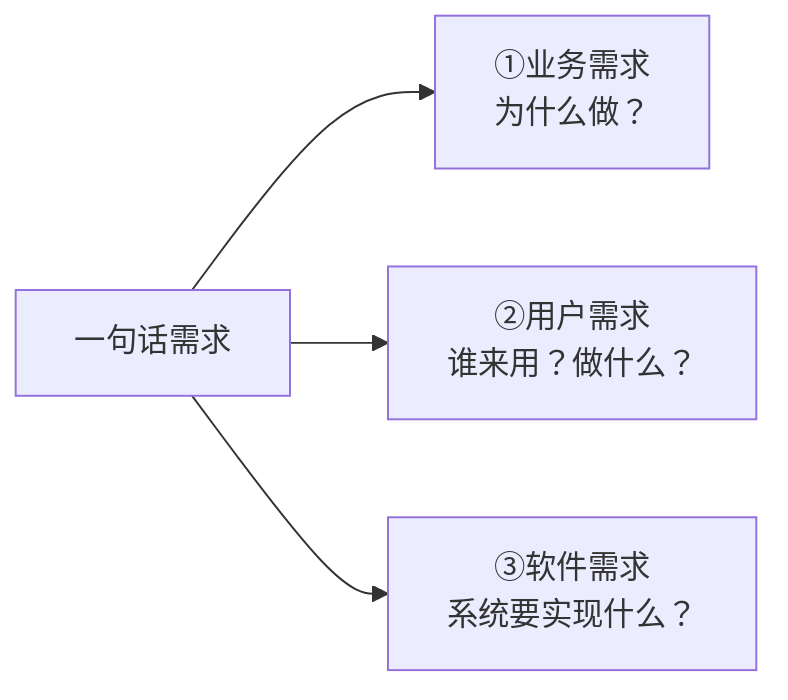
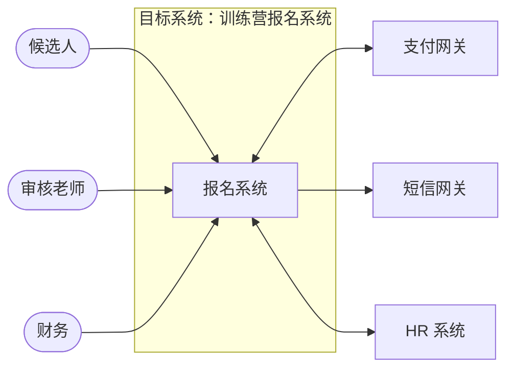
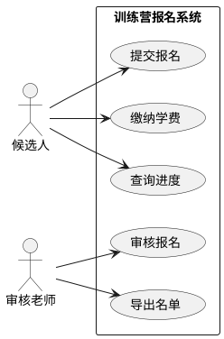
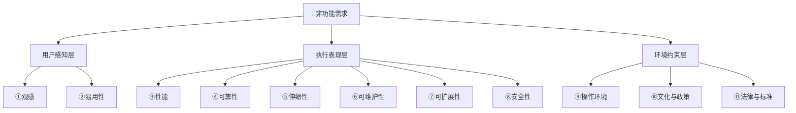

# 27 · 需求分析（30 分钟课件）

> **课程对象**：实习生 / 1-2 年工作经验的产品 / 研发  
> **时长**：30 分钟（讲解 25 + 互动 5）  
> **前置**：建议看过 `02-有效需求分析-功能-1.md` 第 2 章（三层需求模型）  
> **课后产出**：每位学员对训练营给出的"一句话需求"产出 ① 上下文图 ② 1 个核心用例描述 ③ 2 条可量化的非功能需求  
> **来源**：基于本仓库 `02 ~ 05` 系列讲义浓缩，结合 IEEE 830、ISO/IEC 25010、Karl Wiegers《软件需求》、Cohn《用户故事与敏捷方法》、Google SRE 误差预算等业内实践。

---

## 课程目标

学员在本次课程结束后可以做到：

1. **复述**软件需求的三个层次，并能判断手头一句话需求属于哪一层；
2. **画出**目标系统的上下文图，圈出系统边界；
3. **写出**一个用例的标准描述（动宾名称、前后置条件、基本流 + 异常流）；
4. **识别**典型的非功能需求并把"好/快/安全"翻译成可测量的指标；
5. **避开** 5 个最常见的需求分析误区。

> 不在 30 分钟范围内的内容（活动图、状态图、状态矩阵、量化模型谱系等）→ 转 `04-有效需求分析-功能-3.md`、`05-有效需求分析-非功能.md` 自学。

---

## 时间分配

| 段落 | 主题 | 分钟 | 对应工具 |
| --- | --- | --- | --- |
| § 0 | 开场：3 个真实痛点 | 3 | — |
| § 1 | 三层需求模型 | 5 | 业务/用户/软件需求 |
| § 2 | 工具一：上下文图 | 5 | Context Diagram |
| § 3 | 工具二：用例 | 8 | Use Case + 用例描述 |
| § 4 | 非功能需求 & 量化 | 5 | ISO 25010 / 量化模板 |
| § 5 | AI 时代的需求分析 + 总结 + 作业 | 4 | AIDLC、Prompt 模板 |

---

## § 0 · 开场（3 min）

### 0.1 三个似曾相识的场景

| # | 场景 | 真实成本 |
| --- | --- | --- |
| 1 | "先做了再说，需求边写边想" | 上线前 3 天才发现一个核心场景没覆盖，连夜返工 |
| 2 | "客户说得很清楚啊，做出来就是不对" | 客户口中的"导出报表"和你以为的"导出 Excel"不是一回事 |
| 3 | "性能要快、要稳、要安全" | 上线后用户说慢，但没人知道"慢"的红线在哪 |

> **共同根因**：**需求这一头没打牢**——不是开发能力不足，是从一开始就没把"做什么、为谁做、做到什么程度"对齐。

### 0.2 为什么这 30 分钟值得听

| 角色 | 听完能拿走什么 |
| --- | --- |
| 实习产品 | 一份能交给开发的需求最小骨架（上下文图 + 用例 + 非功能清单） |
| 1-2 年研发 | 拿到 PRD 后能反向"翻译"成上下文/用例并发现遗漏 |
| 全员 | 学会把"一句话需求"拆成可验收的需求项，**不再凭感觉做** |

> 本节课**不教你写完美的 SRS**，教你掌握 3 个最高 ROI 的工具，足以应付 80% 的中小型需求场景。

---

## § 1 · 三层需求模型（5 min）

### 1.1 为什么"一句话需求"会失真

听到"我们要做一个学员训练营报名系统"——这句话里至少塞了 3 个层次的信息。直接据此排期，你大概率会做错"做什么"。



### 1.2 三层模型对照

| 层次 | 回答的问题 | 谁来提 / 谁来写 | 产物 |
| --- | --- | --- | --- |
| **业务需求** | 客户/组织**为什么**要做？ | 项目发起人 → 产品负责人 | 项目愿景与范围文档 |
| **用户需求** | 用户**做什么**、想得到什么价值？ | 产品 / 需求分析师 | 用例文档 / 用户故事 |
| **软件需求** | 系统要**实现什么**功能、达到什么质量？ | 研发 / 架构师 | SRS（软件需求规格说明） |

### 1.3 一个具体例子：训练营报名系统

| 层次 | 表达 |
| --- | --- |
| 业务需求 | 把每年校招的训练营报名、审核、缴费、签到流程线上化，**把人力运营成本降低 50%**。 |
| 用户需求 | 候选人能扫码报名并查看进度；审核老师能批量审批；财务能导出对账表。 |
| 软件需求 | 提供 `POST /enrollments` 接口；审核态字段使用枚举 `pending/approved/rejected`；对账表导出为 UTF-8 BOM CSV，列定义如下…… |

> **要点**：层次越往下越具体、越接近实现；越往上越抽象、越接近"为什么"。**直接跳过业务/用户层去做软件需求 = 大概率做错事**。

### 1.4 业务需求要严谨：背景 + 可度量的业务目标

| 反例 | 正例 |
| --- | --- |
| "我们要做一个训练营报名系统。" | **背景**：每年校招训练营有 200+ 候选人，目前用飞书表格 + 微信群手工运营，3 人专职 1 个月。<br>**业务目标**：上线第一年将运营人力从 3 人月降到 1.5 人月，候选人报名到收到结果的平均时间从 5 天降到 1 天。 |

> **判断标准**：业务目标必须**可度量**——有数字才能验收。

### 1.5 § 1 小结

- 拿到一句话需求，先问：**这是哪一层？还有哪两层没说？**
- 业务需求 = 背景 + 可度量目标；用户需求 = 谁/什么场景/做什么/价值；软件需求 = 功能 + 非功能 + 约束。

---

## § 2 · 工具一：上下文图（5 min）

### 2.1 为什么一上来要画上下文图

> **先定义，再分析**——先框出"系统是什么、跟谁打交道"，再去分析里面的功能。  
> 上下文图只画 4 类元素，**5 分钟就能画完，但能挡住 30% 的需求遗漏**。

### 2.2 4 类元素

| 元素 | 说明 | 图形 |
| --- | --- | --- |
| **待建系统** | 中央黑盒（不关心内部） | 矩形 |
| **用户/角色** | 直接交互的人 | 圆角胶囊 |
| **外部系统** | 上下游、第三方系统 | 矩形 |
| **连接器** | 交互关系（不关心具体内容） | 实线 |

### 2.3 案例：训练营报名系统



> **30 秒能从这张图读出**：3 类用户、3 个外部系统，跟支付/短信/HR 都有依赖——这意味着**至少 6 条接口要在 SRS 里说清楚**。

### 2.4 三个最常见的画错

| 误区 | 示例 | 正解 |
| --- | --- | --- |
| ① 把鼠标键盘画成"用户" | "用户、键盘、鼠标都连到系统" | 鼠标键盘是输入设备，不是参与者 |
| ② 画成多层嵌套的"回字图" | 大系统里画小系统、再画更小系统 | 子系统**单独画一张上下文图**，不要嵌套 |
| ③ 把内部模块画进去 | "报名系统 → 用户表 → 订单表" | 上下文图只画**外部**，内部模块到设计阶段再说 |

### 2.5 § 2 小结

- 上下文图只问 3 件事：**用户是谁？依赖谁？被谁依赖？**
- 它的下游用途：用户 → 用例图 Actor；外部系统 → 接口设计；连接器 → 用例线索。

---

## § 3 · 工具二：用例（8 min）

### 3.1 用例是什么

> **用例（Use Case）：站在用户角度，定义系统的外部特征。**

四个本质特征（必须同时满足）：

| 特征 | 一句话 |
| --- | --- |
| **行为序列** | 一组不可再分解的步骤（输入 → 执行 → 结果） |
| **系统执行** | 描述"系统为用户做了什么"，不是"用户自己做了什么" |
| **可观测、有价值的结果** | 没有用户价值的不叫用例 |
| **特定的角色** | 必须有人/外部系统/设备来触发 |

### 3.2 用例图：4 要素



| 要素 | 图形 |
| --- | --- |
| 参与者（Actor） | 火柴人/胶囊 |
| 用例 | 椭圆 |
| 系统边界 | 矩形框 |
| 关联 | 实线 |

### 3.3 用例 vs 功能：很多人在这一步翻车

| 用例（用户视角） | 功能（系统视角） |
| --- | --- |
| 提交报名 | 表单校验 / 数据写库 |
| 缴纳学费 | 调支付接口 / 收回调 / 写订单 |
| 查询进度 | 查询服务 + 缓存 |

> **要点**：用例文档**面向业务和测试**，功能列表**面向开发**。把功能菜单当用例图来画，是最常见的错误。

### 3.4 用例粒度：选"用户的一个有价值子目标"

同一件"维护用户信息"可以画 3 种粒度：

| 粒度 | 适合 | 评价 |
| --- | --- | --- |
| 粗：1 个角色 1 个用例 | 上下文层 | 对开发没指导 |
| **中：按用户子目标拆**（添加/修改/删除/查询） | **需求文档** | **推荐** |
| 细：连"校验用户名"都做成独立用例 | — | 过细，图变难读 |

> **判断口诀**：能不能写出**前置条件 / 后置条件 / 基本事件流**？——能写就是合理粒度，写不出来就是粒度不对。

### 3.5 用例描述的标准 6 字段

每个核心用例都至少要写出 6 个字段：

| 字段 | 写什么 |
| --- | --- |
| **名称** | 唯一标识，**动宾格式**（提交报名 ✓ / 报名 ✗） |
| **简述** | 谁 / 什么场景 / 做什么 / 实现什么目标，1 段话 |
| **前置条件** | 用例执行**前**系统必须满足的可检测状态 |
| **后置条件** | 用例执行**后**系统的状态变化（含成功 + 失败） |
| **基本事件流** | 最典型的成功路径 |
| **异常事件流** | 失败时怎么办 |

#### 完整示例：提交报名

| 字段 | 内容 |
| --- | --- |
| 编号 | UC-ENROLL-01 |
| 名称 | 提交报名 |
| 简述 | 候选人在报名页面填写个人信息与意向方向，提交后等待审核。同一邮箱在同一期训练营内只能提交一次。主要参与者：候选人。 |
| 前置条件 | 当前训练营处于"报名开放"状态；候选人未在本期已成功提交过 |
| 基本事件流 | 1. 候选人打开报名页面<br>2. 系统展示当前训练营信息与表单<br>3. 候选人填写姓名、邮箱、电话、方向、简历链接<br>4. 系统校验邮箱格式与必填项<br>5. 系统检查同一邮箱在本期未提交过<br>6. 系统创建报名记录，状态置为 `pending`<br>7. 系统通过短信网关发送一条提交确认短信<br>8. 系统跳转到"报名成功"页 |
| 异常事件流 | 4a 邮箱格式错误：4a1 系统提示并阻止提交<br>5a 邮箱已报名：5a1 系统提示并展示原报名进度链接<br>7a 短信发送失败：7a1 仅记录日志，不影响主流程 |
| 后置条件 | 成功：报名记录入库 + 状态 = pending + 提交时间已记录；失败：系统状态不变 |

### 3.6 用例描述常见问题

| 问题 | 修法 |
| --- | --- |
| 用例名混用"添加 / 创建 / 新增" | 团队**统一动词** |
| 前置条件写"电脑已开机" | 必须**系统可检测、与用例直接相关** |
| 后置条件只写成功路径 | 必须**含异常情况下的状态** |
| 基本流里塞了一堆 if-else | 把分支拆到**异常流**，基本流只走最典型成功路径 |
| 一个用例事件流写了 30 步 | 粒度过细，可能要拆成多个用例 |

### 3.7 « include » vs « extend »：最常被误用的两个关系

| 维度 | « include » | « extend » |
| --- | --- | --- |
| 基础用例完整性 | **依赖**才完整 | **不依赖**自己就完整 |
| 触发时机 | **必然**执行 | **条件性**执行 |
| 类比 | 函数调用必经分支 | AOP 钩子 |
| 例子 | 提交报名 « include » 校验邮箱 | 提交报名 « extend » 找回密码 |

### 3.8 § 3 小结

- 用例 = 用户视角 + 有价值结果 + 标准描述（6 字段）
- 粒度选"用户的一个有价值子目标"
- 写不出前/后置条件 → 大概率粒度或思路有问题

---

## § 4 · 非功能需求 & 量化（5 min）

### 4.1 为什么非功能往往才是成败关键

> "**非功能性需求决定了要把产品做多好。**"  
> 仓管系统的核心矛盾不是"能不能开单"，而是"开得快不快、准不准"。

### 4.2 11 大类非功能需求（速记图）



> 工程上做查漏补缺时，可对照 **ISO/IEC 25010** 的 8 个质量特性（功能适合性 / 性能效率 / 兼容性 / 易用性 / 可靠性 / 安全性 / 可维护性 / 可移植性）。

### 4.3 唯一一条铁律：**不能测量的需求不是真需求**

| 反例 | 正例 |
| --- | --- |
| 系统要快 | 95% 的请求响应时间 ≤ 1s，最差不超过 4s |
| 系统要稳 | 月可用性 ≥ 99.9%（每月停机 ≤ 43 分钟） |
| 系统要好用 | 候选人首次报名 90 秒内完成，跳出率 < 10% |
| 系统要安全 | 通过等保二级；密码使用 bcrypt + salt 存储；敏感操作记录审计日志 |

### 4.4 量化三件套

每条非功能需求都用 **描述 + 理由 + 验收标准** 表达：

| 类别 | 描述 | 理由 | 验收标准 |
| --- | --- | --- | --- |
| 性能 | 报名提交接口要快 | 候选人移动端环境，慢于 1s 流失明显 | 95% 请求 ≤ 500ms，99% ≤ 1s（线上压测验证） |
| 可用性 | 报名期间系统稳定 | 报名窗口仅 7 天，宕机直接影响业务目标 | 报名期内可用性 ≥ 99.9%，单次故障恢复 ≤ 10 min |
| 安全性 | 候选人简历不可被未授权访问 | 含个人身份信息（PII） | 仅审核老师、财务、本人三类角色可查；所有访问写审计日志 |

### 4.5 性能：不要只看平均值

| 误区 | 修法 |
| --- | --- |
| 只看 avg | **看 P95 / P99 / P99.9**——平均值掩盖长尾 |
| 用单点指标 | 引入 **误差预算**："1 小时内 > 500ms 的请求 ≤ 10 次"，留工程弹性 |

### 4.6 可用性：高可用的"唯一"技术途径

| 公式 | 含义 |
| --- | --- |
| 串联 A = p₁ × p₂ | 任一环节挂 → 整体挂（指标下降） |
| 并联 A = 1 − (1 − p₁)(1 − p₂) | 任一环节存活 → 整体存活（指标提升） |

> 两个 99% 的服务串联 → 98.01%；并联 → 99.99%。  
> **冗余是提升可用性的唯一技术手段**——主备、双活、多副本本质相同。

### 4.7 § 4 小结

- 用 ISO 25010 / 11 大类做查漏补缺
- 每条非功能需求都写"描述 + 理由 + 验收标准"
- 性能看 P95/P99；可用性靠冗余；安全靠访问控制 + 审计 + 加密
- **没有数字 = 没有验收标准 = 没有需求**

---

## § 5 · AI 时代的需求分析 & 总结（4 min）

### 5.1 AI 把流程改了多少？

| 环节 | 传统做法 | AI 时代做法 |
| --- | --- | --- |
| 一句话需求 → 业务需求 | 多轮访谈 + 文档 | AI 帮你列**追问清单**，仍需人确认 |
| 用户需求 → 用例 | 手写 N 份用例 | AI 基于上下文图扩展候选用例，**人评审** |
| 用例 → 测试用例 | 测试自己写 | AI 直接生成 + 多模型交叉评审 |
| 非功能需求 | 拍脑袋"高可用、高安全" | AI 给量化建议，**人定阈值** |

> **关键**：AI 加速产出，但**判断权和责任**留在人这边。**不要让 AI 替你做需求决策**。

### 5.2 一个可直接复用的 Prompt 骨架

```text
你是一个资深需求分析师。我现在有如下一句话需求：
<在此粘贴一句话>

请帮我做以下事情，每一步先输出，再等我确认后才进入下一步：
1) 用三层模型把它拆成「业务需求 / 用户需求 / 软件需求」，业务目标必须可度量；
2) 给出目标系统的上下文图（用 mermaid flowchart），列出用户、外部系统；
3) 列出 5~8 个候选用例，注明粒度合理性；
4) 选 1 个最核心的用例，写完整 6 字段描述；
5) 列出 5 条非功能需求，每条用「描述/理由/验收标准」三件套量化。

约束：
- 假设需要明确指出，不要替我做决策；
- 输出中文；
- 用例名必须动宾格式。
```

### 5.3 5 个最高 ROI 的避坑清单

| # | 避坑要点 |
| --- | --- |
| 1 | 一句话需求**必须先归位三层**，再开排期 |
| 2 | **先画上下文图**——5 分钟挡住 30% 的遗漏 |
| 3 | 用例名**动宾格式 + 团队统一动词**，前/后置条件**系统可检测** |
| 4 | 非功能需求**全部数字化**，性能看高百分位 |
| 5 | AI 加速产出，**但人对判断负责** |

### 5.4 课后作业（10 分钟可完成）

> 训练营给你的一句话需求：  
> **"做一个 Workshop 学员产出物提交与导师评分系统。"**

请输出：

1. 业务需求 / 用户需求各 1 段（业务需求含可度量目标）；
2. 上下文图（mermaid）；
3. 列出 ≥ 5 个候选用例 + 选 1 个写完整 6 字段描述；
4. ≥ 3 条量化的非功能需求（覆盖性能、可用性、安全性）。

**交付方式**：写在 `submissions/<你的名字>/27-需求分析作业.md`，Day 2 上午导师 review。

### 5.5 推荐延伸阅读

| 资源 | 用途 |
| --- | --- |
| 本仓库 `02 ~ 05` 系列讲义 | 深度补全活动图 / 状态图 / 状态矩阵 / 量化模型谱系 |
| Karl Wiegers《软件需求》第 3 版 | 业内最常引用的需求工程教科书 |
| Mike Cohn《用户故事与敏捷方法》 | 用户故事与用例的取舍 |
| ISO/IEC 25010 标准 | 非功能需求查漏补缺的最完整地图 |
| Google SRE Book — SLO/Error Budget 章节 | 非功能"误差预算"工程化思路 |

---

## 附录 A · 30 分钟讲师 Cue Sheet

| 时间点 | 节奏 | 关键动作 |
| --- | --- | --- |
| 0:00 | 开场 | 讲三个痛点，问全场"踩过哪个？"举手 |
| 3:00 | § 1 三层模型 | 用训练营报名系统案例，3 行表格秒懂 |
| 8:00 | § 2 上下文图 | **现场画一张**——30 秒一张，强调"先定义再分析" |
| 13:00 | § 3 用例 | 现场写 1 个用例 6 字段（提交报名），让学员补异常流 |
| 21:00 | § 4 非功能 | 现场把"系统要快、要稳、要安全"改写成数字 |
| 26:00 | § 5 AI + 总结 | 演示 Prompt 骨架，**展示 1 次 AI 输出**让学员评审 |
| 29:00 | 作业布置 | 留 1 分钟答疑，散场 |

## 附录 B · 易混淆概念速查

| 概念 A | 概念 B | 怎么区分 |
| --- | --- | --- |
| 用例 | 功能 | 用例 = 用户视角；功能 = 系统视角 |
| « include » | « extend » | include = 必然执行；extend = 条件触发 |
| 活动图 | 状态图 | 节点是"动作" → 活动图；节点是"阶段" → 状态图 |
| 可用性 | 可靠性 | 可用性 = 时间占比；可靠性 = MTBF |
| 约束 | 解决方案 | 约束必须遵守；解决方案是建议 |

